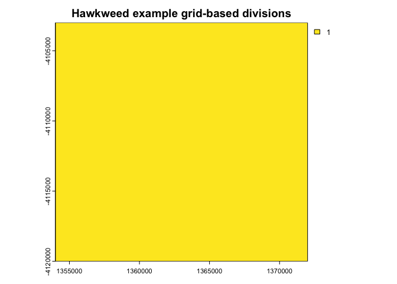
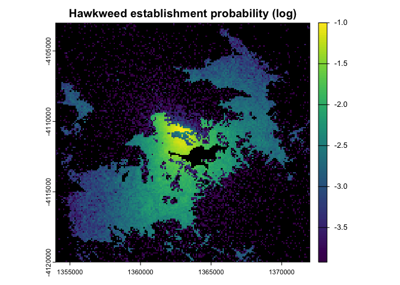
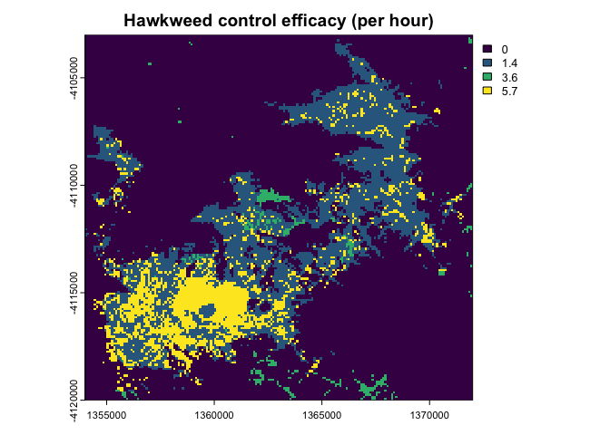
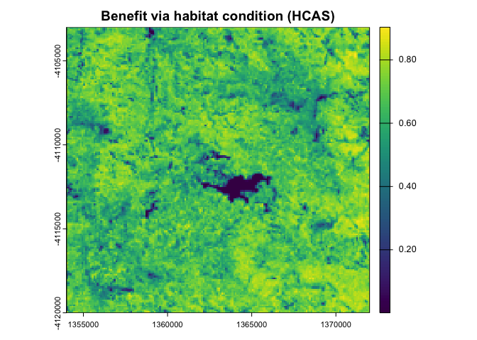
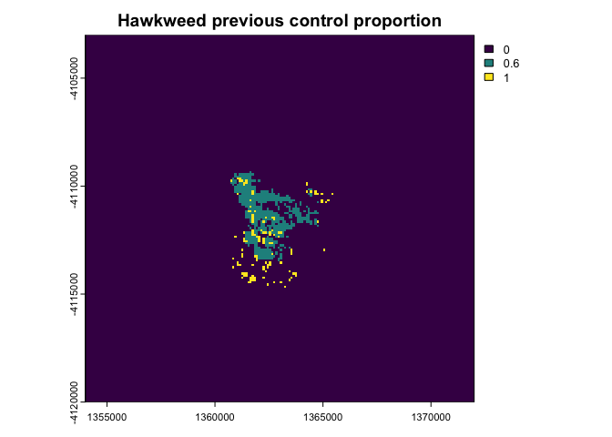
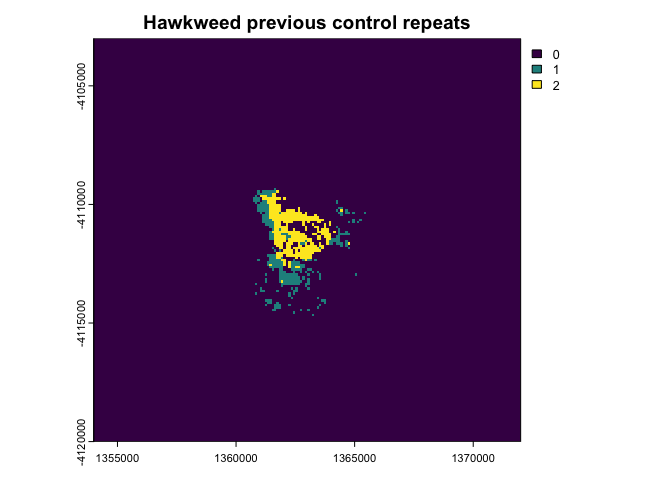
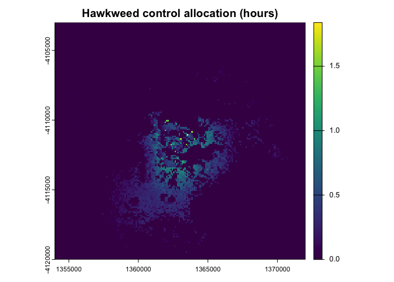
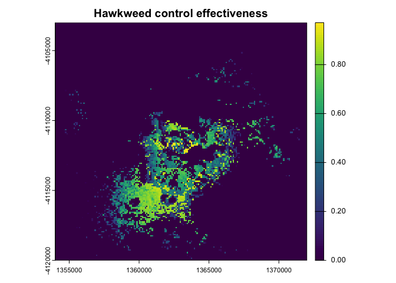
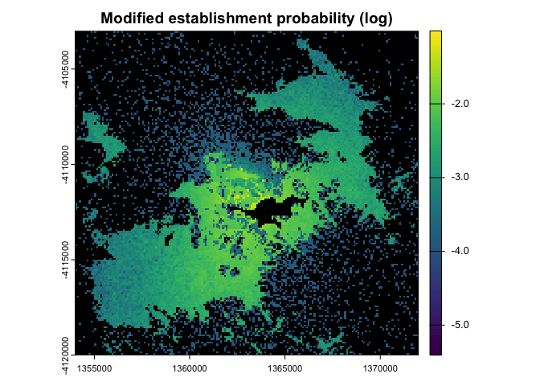

<!-- README.md is generated from README.Rmd. Please edit that file -->

# bsmanage: Biosecurity Management Resource Allocation

<!-- badges: start -->

[](https://github.com/cebra-analytics/bsmanage/commits/main)
<!-- badges: end -->

The *bsmanage* package provides a collection of workflow components
implemented in *R* (<https://www.r-project.org/>) as *S3* object
classes, which encapsulate functionality for building models or designs
for effective allocations of biosecurity management resources.
Management resource allocation models are constructed by building and
linking workflow components as follows:

1.  Define the context of the biosecurity management resource
    allocation.
2.  Specify the spatial or other divisions that the management resources
    are to be allocated across.
3.  Assemble a management resource allocation model or design with
    configuration appropriate for the method and allocation conditions
    and generate the design.

## Workflow components

This section further describes the workflow components for building
management resource allocation models.

### ManageContext

The context of the biosecurity management resource allocation is defined
via the *ManageContext* object class, and outlines information (where
applicable and available) about the study including:

- The threat species name.
- The type of invasive species or threat (pest, weed, or disease).
- The type of management resource utilised (e.g. surveys, traps,
  treatments, removals).
- The purpose of the management (e.g. delimitation, containment,
  eradication).
- The status of the invasive species presence:
  - Detected.
  - Delimited.
  - Contained.
  - Eradicated.

### ManageDivisions

The spatial or other divisions that the management resources are to be
allocated across are specified via the *ManageDivisions* object class
and may be configured as either:

- A grid-based spatial raster layer (GeoTIFF file), whereby resource
  allocation design parameters are specified, and allocations of
  management resources are generated, across the active (non-NA) cell
  locations.
- A network of spatial locations or patches defined via a table of
  longitude and latitude coordinates (CSV file), across which resource
  allocation design parameters are specified, and allocations of
  management resources are generated.
- Non-spatial divisions (or spatial divisions without specified
  locations) defined via a table (CSV file), whereby resource allocation
  design parameters are specified, and allocations of management
  resources are generated, across divisions such as resource types,
  management strategies, invasion pathways, invasive species, disease
  categories, etc.

### Management designs

Management designs may utilise various methods for generating effective
management resource allocations across specified *divisions*, and
calculating management effectiveness (or probability of success). The
*ManageDesign* object class provides a generic *base class* or template,
with configuration and functionality common to different surveillance
management approaches, including:

- Linking to a *ManageContext* class object.
- Linking to a *ManageDivisions* class object.
- Generating an effective management resource allocation.
- Calculating the management effectiveness (the probability of
  successful management when the threat is present).
- Calculating the system-wide average and overall management
  effectiveness across all divisions.
- Saving resource allocation designs.

Management resource allocation approaches may be encapsulated in object
classes that are based on (or *inherit*) the *ManageDesign* class. Most
generic functionality provided in the *ManageDesign* class is overridden
by inherited classes with implementations specific to the resource
allocation method encapsulated. The inherited object classes implement
different resource allocation design approaches. So far, this includes:

- Control design

The resource allocation design approaches and their implemented object
classes are further described in the sections that follow.

#### Control design

The *ControlDesign* object class implements an extended resource
allocation design method for the effective allocation of management
resources across spatial (or other) divisions. The extended method is
derived from optimisation approaches described in Cannon (2009),
Giljohann et al. (2011), Hauser et al. (2007), Hauser & McCarthy (2009),
McCarthy et al. (2010), and Moore, McCarthy, & Lecomte (2016), along
with approaches for incorporating existing management effectiveness
derived from those described in Anderson et al. (2017). The optimisation
functionality is encapsulated within the *LagrangeMgmtDesign* object
class (see below), which is utilised within the *ControlDesign* object
class. The control design method implementation includes configuration
for:

- The management context via a *ManageContext* class object.
- The spatial locations (or other divisions) for the design via a
  *ManageDivisions* class object.
- The type of dimension or divisons that the management resources are
  allocated across (e.g. spatial, species, pathways) .
- The establishment or occurrence probabilities of the threat at each
  location (or other division). Relative probabilities may be utilised.
- Calculating the overall management effectiveness, or probability of
  successful management when the threat is present, at each location (or
  other division) as per Anderson et al. (2017), Cannon (2009),
  Giljohann et al. (2011), Hauser et al. (2007), Hauser & McCarthy
  (2009), McCarthy et al. (2010), and Moore, McCarthy, & Lecomte (2016)
  via either:
  - Continuous resources (e.g. control time, treatment volume) using:
    - The efficacy ($\lambda$) or control rates for each location (or
      other division).
    - The equation for calculating overall effectiveness $e(n)$ for a
      given allocation ($n$) of control resources at a location (or
      other division):  
      $e(n) = 1 - exp(-\lambda n)$  
  - Discrete resources (e.g. traps, removals) using:
    - The unit effectiveness ($p$) each location (or other division).
    - The equation for calculating overall effectiveness $e(n)$ for a
      given allocation ($n$) of control resources at a location (or
      other division):  
      $e(n) = 1 - (1 - p)^n$  
- Finding an effective or optimal management resource allocation design
  based on:
  - An optimisation strategy, either:
    - Maximum saving.
    - Maximum benefit.
    - Maximum number of successful management applications.
    - Maximum overall system-wide effectiveness (probability of
      success).
    - None for representing existing control designs (see below).
  - Note that actual (not relative) establishment or occurrence
    probabilities must be specified for saving, or effectiveness-based
    optimisation.
  - Optimisation parameters, including:
    - Estimated savings (cost-based benefit) at each location (or other
      division). Used for optimal maximum saving.
    - Estimated (non-monetary) quantified benefit values at each
      location (or other division). Used for optimal maximum benefit.
    - Cost per unit of allocated control resources at each location (or
      other division).
    - Fixed costs, such as travel costs or time, at each location (or
      other division).
  - Optimisation constraints, including:
    - The cost budget or maximum number of control resources available.
    - The desired (minimum) weighted average effectiveness or success
      probability of success of the control design (e.g. 0.95). The
      weighted average is calculated using (relative) establishment
      probability values.
    - The desired (minimum) system-wide effectiveness or success
      probability of the control design (e.g. 0.90).
    - The minimum permissible control resource allocation at each
      location (or other division), to avoid impractically low resource
      allocations.
    - The maximum permissible control resource allocation at each
      location (or other division), to avoid impractically high resource
      allocations.
    - An indication of whether the resource allocation at each location
      (or other division) should be discrete integers (e.g. traps,
      removals), or continuous quantities (e.g. control time, treatment
      volume).
- Calculating effectiveness for existing control resource allocation
  designs based on:
  - Existing control resource quantities (e.g. control hours or devices)
    at each location (or other division). Used when the optimisation
    strategy is specified as “none”.
- Control effectiveness of existing control resources present at each
  location (or other division) may be optionally incorporated into the
  design.
- Previous control may be optionally incorporated into the design via:
  - Control proportion values previously applied at each location (or
    other division).
  - Control repeat values indicating the number of times the control was
    previously applied at each location (or other division).
  - These values modify the establishment likelihood values utilised in
    the allocation design such that :  
    $Pr(establishment)_{modified}= Pr(establishment)\cdot (1-proportion)^{repeats}$

#### Lagrange management design optimisation

The *LagrangeMgmtDesign* object class encapsulates an implementation of
generalised optimisation approaches for the effective allocation of
management resources across one or more divisions (parts, locations,
categories, etc.) via Lagrange-based methods described in Hauser &
McCarthy (2009), McCarthy et al. (2010), and Moore, McCarthy, & Lecomte
(2016). The implemented method is summarised by the following steps (see
Moore, McCarthy, & Lecomte, 2016 - Appendix S3):

1.  Formulate an objective function $f(n)$ for a given management
    resource allocation ($n$) across locations or other divisions, based
    on:
    - The establishment or occurrence probabilities ($p_i$) at each
      location/division ($i$).
    - The effectiveness (probability of management success) formulation
      $e(n)$ (see previous sections).
    - An optimisation strategy, such as:
      - Maximum overall savings from successful management applications
      - Maximum benefit from successful management applications
      - Maximum number of successful management applications
      - Maximum overall system-wide effectiveness
    - Management allocation costs, savings, or non-monetary benefits
      where applicable.
    - Criteria for avoiding negative allocations or allocations costing
      more than savings (where applicable), or other mathematical
      constraints (e.g. avoid dividing by zero), dependent on the
      formulation. The objective function is usually discontinuous due
      to criteria.  
    - The objective function is commonly a weighted summation across
      locations/divisions ($i$):  
      $f(n) = \sum_ip_if_i(n_i)/\sum_ip_i$  
      Except for the objective function for maximum system-wide
      effectiveness ($e_{system}$) where:  
      $e_{system}(n) = \prod_i(1-p_i(1-e(n_i)))$ is utilised in the
      formulation of $f(n)$.
2.  Derive the (partial) derivative(s) $f'(n)$ (or marginal benefit) of
    the objective function. The optimal solution occurs when the
    marginal benefit is constant ($\alpha$) across locations/divisions
    ($i$), that is:  
    $f_i'(n_i) = \alpha$ for all locations/divisions ($i$).
3.  Derive the pseudo-inverse $f^+(\alpha)$ of the derivative function
    via algebraic rearrangement of the derivative (if possible), such
    that given an *alpha* value ($\alpha$) the function generates
    allocations ($n_i$) for each location/division ($i$).
4.  Perform an iterative search for the *alpha* value that corresponds
    to the optimal solution for the objective function $f(n)$, given any
    budget or other constraints (e.g. desired minimum system-wide
    sensitivity). Note that budget or other constraints are optional for
    cost or saving-based optimisation.

The *LagrangeMgmtDesign* object class is is utilised within the
*ControlDesign* object class (see previous section), and includes
configuration for:

- The management context via a *ManageContext* class object.
- The spatial locations (or other divisions) for the design via a
  *ManageDivisions* class object.
- The establishment or occurrence probabilities of the threat at each
  location or other division. Relative probabilities may be utilised.
- The formulated functions (as above) specific to configured management
  resource allocation designs (within the *ControlDesign* object class),
  including:
  - The objective function $f(n)$.
  - The (partial) derivative(s) $f'(n)$ of the objective function.
  - The pseudo-inverse $f^+(\alpha)$ of the derivative function, plus
    configuration for $\alpha$ value constraints.
- Functions for calculating effectiveness $e_i(n_i)$ and its inverse
  (i.e. allocations) $n_i(e_i)$ at each location/division ($i$).
- Optimisation constraints:
  - The cost budget or maximum number of management resources available.
  - The desired (minimum) weighted average effectiveness or success
    probability of success of the management resource allocation
    (control) design (e.g. 0.95).
  - The desired (minimum) system-wide effectiveness or management
    success probability of the management resource allocation (control)
    design (e.g. 0.90).
  - Minimum allocation quantities at each location/division.

## Installation

You can install the latest version of *bsmanage* from
[GitHub](https://github.com/) with:

``` r
remotes::install_github("cebra-analytics/bsmanage")
```

## Example

The following example builds a control management resource allocation
design for Orange Hawkweed (*Hieracium aurantiacum*), an exotic weed for
Australia, which modifies the “search and destroy” design described in
Hauser & McCarthy (2009) with techniques for incorporating previous
control efforts and calculating control effectiveness from Giljohann et
al. (2011). In the following steps we build the workflow components, run
the design model, and examine the control design results.

### Step 1: Management context

We define the management context of the Hawkweed control, including
details about the threat and the management resource used. In the study
described in Hauser & McCarthy (2009) yearly “search and destroy”
surveys are conducted to locate and eradicate the weed. Control efforts
and costs are measured in hours. The Hawkweed had been detected in past
surveys and locally eradicated, although its persistence in the study
area is unknown. We build our *ManageContext* class object with the
relevant details.

``` r
# Hawkweed management context
context <- bsmanage::ManageContext(species_names = "Hieracium aurantiacum",
                                   species_types = "weed",
                                   resource_type = "survey",
                                   management_purpose = "eradication",
                                   threat_status = "detected")
```

### Step 2: Management divisions

In our example we will allocate management resources across grid-based
spatial divisions. The region of interest for our Hawkweed control model
is the Bogong High Plains area surrounding the ski-resort township of
Falls Creek in Victoria, Australia. We derive template raster (GeoTIFF)
for the region from the National Vegetation Information System (NVIS)
V7.0 (NVIS, 2025) raster layers. We also use the NVIS data in step 3.
Users may download [NVIS Raster
Geodatabases](https://www.dcceew.gov.au/environment/environment-information-australia/national-vegetation-information-system/data-products)
and place them in a suitable directory (e.g. *downloaded_data*) before
loading and transforming the NVIS layer. We build our *ManageDivisions*
class object with our 100 m resolution template.

``` r
# Load NVIS major vegetation groups (MGV)
nvis_rast <- terra::rast(
  paste0("../downloaded_data/NVIS_V7_0_AUST_RASTERS_EXT_ALL/",
         "NVIS_V7_0_AUST_EXT.gdb"))[["NVIS7_0_AUST_EXT_MVG_ALB"]]
# Crop to the region of interest
region_nvis_rast <- terra::crop(nvis_rast,
                                c(1354000, 1372000, -4120000, -4103000))
# ManageDivisions class object configured with a masked NVIS template
divisions <- bsmanage::ManageDivisions(+(region_nvis_rast > 0))
terra::plot(divisions$get_rast(1), colNA = "grey",
            main = "Hawkweed example grid-based divisions")
```



### Step 3: Control design

We build our control design model for allocating “search and destroy”
control survey efforts across the grid-based region using the
*ControlDesign* object class with configuration for:

- The management context via a *ManageContext* class object.
- The spatial locations for the design via a *ManageDivisions* class
  object.
- Establishment or occurrence probabilities of the threat at each
  location (see below).
- The efficacy ($\lambda$) or *lambda* (see below) for calculating the
  control management effectiveness $e(n)$ for a given allocation ($n$)
  of control resources at each location via:
  - $e(n) = 1 - exp(-\lambda n)$
- Finding an effective or optimal control survey effort allocation
  design based on those described in Giljohann et al. (2011), Hauser &
  McCarthy (2009), McCarthy et al. (2010), and Moore, McCarthy, &
  Lecomte (2016):
  - A maximum non-monetary benefit optimisation strategy based on
    habitat condition.
  - As per Hauser & McCarthy (2009), we will find survey allocations
    with and without a cost budget of 1125 hours.
- Control (proportion and repeats) previously applied to the region
  (Giljohann et al., 2011), which was approximated for demonstration
  purposes based on previous detection (and removal) locations described
  in Hauser & McCarthy (2009) and Williams et al. (2008).

Before building and running our control design, we will create raster
layers for establishment probability, efficacy (*lambda*), benefit
(habitat condition), and previous control (proportion and repeats).

#### Establishment probability layer

The establishment or occurrence probability layer utilised in the Hauser
& McCarthy (2009) “search and destroy” survey design was the
“dispersal-constrained habitat suitability” model described in Williams
et al. (2008) for predicting the relative likelihood of arrival and
establishment of Orange Hawkweed across the Boyong High Plains area. In
our population spread simulation example described in the
[bsspread](https://github.com/cebra-analytics/bsspread) package, we
approximately reproduced the spread distribution of the Williams et al.
(2008) model. Here we utilise the mean occupancy output (at time step 2)
from our example spread model simulations, which may be downloaded from
[here](https://github.com/cebra-analytics/bsdesign/tree/main/data) and
copied into a *data* directory.

The Williams et al. (2008) “dispersal-constrained habitat suitability”
model contains values of no more than 0.1. In demonstrating their
“search and destroy” survey design method via cost-based optimisation,
Hauser & McCarthy (2009) utilised the Williams et al. (2008) model as
actual (not relative) probabilities of threat presence. In our example
spread model, however, we initialised every simulation with an
established threat presence, resulting in a spread distribution
containing mean occupancies greater than 0.1. We thus scale our mean
occupancy output to make it consistent with that presented in Williams
et al. (2008).

``` r
# Load the mean occupancy from the spread simulation example
mean_occupancy_rast <- terra::rast("data/occupancy_t2_mean.tif")
# Scale for consistency with Williams et al. (2008)
establish_pr_rast <-
  mean_occupancy_rast*0.1/terra::minmax(mean_occupancy_rast)[2]
terra::plot(log(establish_pr_rast, base = 10), colNA = "black",
            main = "Hawkweed establishment probability (log)")
```



#### Efficacy (*lambda*) layer

The “search and destroy” control efficacy (*lambda*) utilised in Hauser
& McCarthy (2009) was estimated with values, dependent on vegetation, of
2.3714 per minute for grass, and 0.6020 per minute for shrubby
vegetation, for each surveyed 20 metre grid cell. Firstly, we will scale
these values for our model, in which we utilise 100 metre grid cells and
hourly survey effort allocations, by $60/25$. We then distribute these
scaled efficacy values across the region based on the vegetation type
from our cropped NVIS (NVIS, 2025) raster from step 2. We will utilise
the mean of these two values for other vegetation

``` r
# Set efficacy (lambda) for grass and shrubby vegetation
efficacy_rast <- terra::classify(
  region_nvis_rast,
  matrix(c(
    17, 0.6020*60/25, # Shrublands
    18, 0.6020*60/25, # Heathlands
    19, 2.3714*60/25, # Tussock Grasslands
    21, 2.3714*60/25, # Other Grasslands, etc.
    25, mean(c(0.6020, 2.3714))*60/25, # Cleared, non-native vegetation, buildings
    26, mean(c(0.6020, 2.3714))*60/25 # Unclassified native vegetation
  ), ncol = 2, byrow = TRUE),
  others = 0)
terra::plot(efficacy_rast, main = "Hawkweed control efficacy (per hour)",
            colNA = "black")
```



#### Habitat condition (benefit) layer

In our population spread simulation example described in the
[bsspread](https://github.com/cebra-analytics/bsspread) package, we
estimated non-monetary environmental impacts of Hawkweed presence via a
quantifiable loss in habitat condition using the the [CSIRO HCAS
layer](https://data.csiro.au/collection/csiro:63571) (Valavi et al.,
2025). Our control design may also utilise habitat condition as an
estimate of environmental impacts for maximising the benefit of “search
and destroy” control at locations where threat impacts are likely to be
highest. The habitat condition layer may be downloaded and placed it in
a suitable directory (e.g. *downloaded_data*).

``` r
# Control benefit via habitat condition (HCAS)
hcas_rast <- terra::rast("../downloaded_data/HCAS33_HCB_1988_2024.tif")
hcas_rast <- terra::resample(
  terra::project(terra::crop(hcas_rast,
                             c(1354000, 1372000, -4120000, -4103000)),
                 region_nvis_rast), region_nvis_rast)
terra::plot(hcas_rast, colNA = "grey",
            main = "Benefit via habitat condition (HCAS)")
```



#### Previous control layers

Control previously applied to the region has been approximated for
demonstration purposes based on previous detection (and removal)
locations described in Hauser & McCarthy (2009) and Williams et
al. (2008). As per the technique described in Giljohann et al. (2011),
previous control is defined via the proportion of control applied and
the number of repeated applications at each location. Previous control
is used to modify the establishment probability, thus reducing the
likelihood of occurrence in previously managed locations. Our
approximate previous control (proportion and repeats) layers may be
downloaded from
[here](https://github.com/cebra-analytics/bsmanage/tree/main/data) and
copied into a *data* directory.

``` r
# Load the previous control proportion and repeats layers
prev_control_prop <- terra::rast("data/prev_control_prop.tif")
terra::plot(prev_control_prop, colNA = "black",
            main = "Hawkweed previous control proportion")
```



``` r
prev_control_reps <- terra::rast("data/prev_control_reps.tif")
terra::plot(prev_control_reps, colNA = "black",
            main = "Hawkweed previous control repeats")
```



#### Control design model

Our control design involves finding an effective or optimal allocation
of “search and destroy” control effort based on maximising the
environmental non-monetary benefit of habitat condition preservation,
with a budget constraint of 1125 hours.

``` r
# Control design
prev_control <- prev_control_prop[divisions$get_indices()][,1] # as vector
attr(prev_control, "repeats") <- prev_control_reps[divisions$get_indices()][,1]
control_design <- bsmanage::ControlDesign(
  context = context,
  divisions = divisions,
  dim_type = "spatial",
  establish_pr = establish_pr_rast[divisions$get_indices()][,1], # as vector
  lambda = efficacy_rast[divisions$get_indices()][,1], # as vector
  optimal = "benefit",
  alloc_unit = "hours",
  cost_unit = "hours",
  benefit = hcas_rast[divisions$get_indices()][,1], # as vector
  budget = 1125,
  previous_control = prev_control)
output <- control_design$save_design()
terra::plot(terra::rast("allocation.tif"),
            main = "Hawkweed control allocation (hours)",
            colNA = "black")
```



The spatial distribution of the control effectiveness (or probability of
management success when present) is also saved with the design:

``` r
# Control design effectiveness
terra::plot(terra::rast("manage_pr.tif"),
            main = "Hawkweed control effectiveness",
            colNA = "black")
```



The modified establishment probability, as calculated using the previous
control, is also provided in the design outputs:

``` r
# Modified establishment probability
terra::plot(log(terra::rast("mod_establish_pr.tif"), base = 10),
            main = "Modified establishment probability (log)",
            colNA = "black")
```



The saved design also provides a point-based CSV table indicating the
control allocation and its effectiveness (management probability), as
well as the modified establishment probability, at each location with
applied control. A system-wide summary table is also provided, including
the total control allocation, the system-wide average and overall
effectiveness (success probability):

``` r
# Control design table
head(read.csv("design.csv"), 10)
#>         lon       lat  allocation  manage_pr mod_establish_pr
#> 1  147.3211 -36.81057 0.019681373 0.10596806      0.001312649
#> 2  147.3129 -36.81592 0.048164557 0.23976055      0.001551313
#> 3  147.3119 -36.81693 0.041108285 0.20860815      0.001670644
#> 4  147.3141 -36.81671 0.040180819 0.20441971      0.001670644
#> 5  147.3098 -36.81804 0.078518653 0.36037801      0.001670644
#> 6  147.3166 -36.81829 0.025912857 0.13711979      0.001312649
#> 7  147.3047 -36.82127 0.003801807 0.02140504      0.001312649
#> 8  147.2993 -36.82271 0.037052242 0.19012685      0.001909308
#> 9  147.3081 -36.82185 0.062636646 0.29986892      0.001670644
#> 10 147.3226 -36.82044 0.004781848 0.02684822      0.001312649
# Control design summary
read.csv("summary.csv")
#>   total_allocation average_pr   overall_pr
#> 1             1125  0.4349737 2.999149e-09
```

## References

Anderson, D. P., Gormley, A. M., Ramsey, D. S. L., Nugent, G., Martin,
P. A. J., Bosson, M., Livingstone, P., & Byrom, A. E. (2017).
‘Bio-economic optimisation of surveillance to confirm broadscale
eradications of invasive pests and diseases’. *Biological Invasions*,
19(10), 2869–2884.
[doi:10.1007/s1053001714905](https://doi.org/10.1007/s1053001714905)

Cannon, R. M. (2009). ‘Inspecting and monitoring on a restricted
budget - where best to look?’ *Preventive Veterinary Medicine*, 92(1–2),
163-174.
[doi:10.1016/j.prevetmed.2009.06.009](https://doi.org/10.1016/j.prevetmed.2009.06.009)

Giljohann, K. M., Hauser, C. E., Williams, N. S. G., & Moore, J. L.
(2011). ‘Optimizing invasive species control across space: willow
invasion management in the Australian Alps’. *Journal of Applied
Ecology*, 48(5), 1286–1294.
[doi:10.1111/j.1365-2664.2011.02016.x](https://doi.org/10.1111/j.1365-2664.2011.02016.x)

Hauser, C. E., Giljohann, K. M., Rigby, M., Herbert, K., Curran, I.,
Pascoe, C., Williams, N. S. G., Cousens, R. D., & Moore, J. L. (2016).
‘Practicable methods for delimiting a plant invasion’. *Diversity and
Distributions*, 22(1/2), 136–147.
[doi:10.1111/ddi.12388](https://doi.org/10.1111/ddi.12388)

Hauser, C. E., & McCarthy, M. A. (2009). ‘Streamlining “search and
destroy”: cost-effective surveillance for invasive species management’.
*Ecology Letters*, 12(7), 683–692.
[doi:10.1111/j.1461-0248.2009.01323.x](https://doi.org/10.1111/j.1461-0248.2009.01323.x)

Hauser, C. E., Runge, M. C., Cooch, E. G., Johnson, F. A., & Harvey, I.
W. F. (2007). ‘Optimal control of Atlantic population Canada geese’.
*Ecological Modelling*, 201(1), 27–36.
[doi:10.1016/j.ecolmodel.2006.07.019](https://doi.org/10.1016/j.ecolmodel.2006.07.019)

McCarthy, M. A., Thompson, C. J., Hauser, C., Burgman, M. A.,
Possingham, H. P., Moir, M. L., Tiensin, T., & Gilbert, M. (2010).
‘Resource allocation for efficient environmental management’. *Ecology
Letters*, 13(10), 1280–1289.
[doi:10.1111/j.14610248.2010.01522.x](https://doi.org/10.1111/j.14610248.2010.01522.x)

Moore, A. L., McCarthy, M. A., & Lecomte, N. (2016). ‘Optimizing
ecological survey effort over space and time’. *Methods in Ecology and
Evolution*, 7(8), 891–899.
[doi:10.1111/2041210X.12564](https://doi.org/10.1111/2041210X.12564)

National Vegetation Information System (NVIS) V7.0
<https://www.dcceew.gov.au/> from copyright Commonwealth of Australia
2025

Valavi R, Levick SR, Lehmann EA, Liu N, Giljohann KM, Williams KJ,
Collings S, Johnson S, Botha EJ, Munroe SEM, Van Niel TG, Newnham G,
Paget M, Malley C, Carlile P, Gunawardana D, Lyon P, Richards AE,
Tetreault Campbell S and Ferrier S (2025) ‘HCAS 3.3 (1988-2024) base
model estimate of habitat condition (90m grid), National Connectivity
Index 2.0 (NCI) and annual time series for continental Australia’. Data
collection 65549. *CSIRO*, Canberra, Australia. DOI:
<https://data.csiro.au/collection/csiro:65549>.

Williams, N. S. G., Hahs, A. K., & Morgan, J. W. (2008). ‘A
Dispersal-Constrained Habitat Suitability Model for Predicting Invasion
of Alpine Vegetation’. *Ecological Applications*, 18(2), 347–359.
[doi:10.1890/07-0868.1](https://doi.org/10.1890/07-0868.1)
